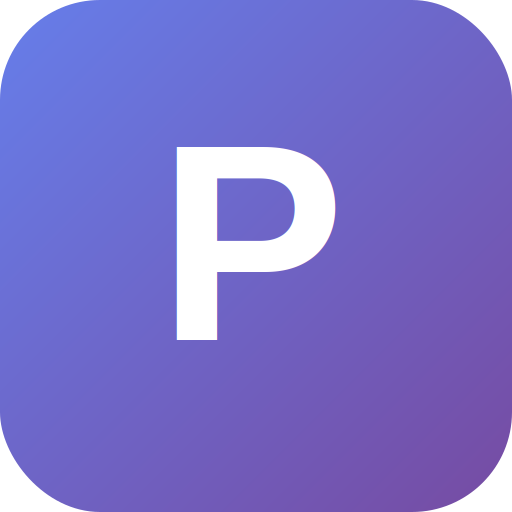

<div align="center">
  
  
  # Prism Browser
  
  ### A Revolutionary Multi-Engine Web Browser
  
  [](LICENSE.md)
  [](https://github.com/prism-browser/prism)
  [](https://github.com/prism-browser/prism/releases)
  [](https://www.electronjs.org/)
  
  **Switch between Firefox, Chromium, Tor, and custom Prism engines — all in one browser.**
  
  [Features](#features) • [Installation](#installation) • [Usage](#usage) • [Documentation](#documentation) • [Contributing](#contributing) • [License](#license)
  
</div>

---

## 🚀 Features

### **Multi-Engine Architecture**
- **🦊 Firefox Engine** - Real Mozilla Firefox with Gecko rendering
- **🔵 Chromium Engine** - Native Chromium with Blink rendering  
- **🧅 Tor Engine** - Anonymous browsing via Tor network with per-tab circuits
- **🔷 Prism Engine** - Custom lightweight rendering engine

### **Privacy First**
- 🔒 Isolated sessions per engine
- 🛡️ Enhanced privacy protections for Tor and Firefox
- 🚫 WebRTC leak prevention
- 🎭 Canvas fingerprinting protection
- 🌐 Engine-specific search engines (DuckDuckGo, Google, Onion services)

### **Power User Features**
- ⚡ Per-tab engine selection
- 🎨 Drag-and-drop tab reordering
- 🔄 Instant tab switching with proper context preservation
- 💰 Built-in crypto wallet (Ethereum)
- 🧩 Extension support (coming soon)
- 🎯 Smart address bar with engine-aware search

### **Modern Design**
- 🍎 Apple-inspired clean interface
- 🎨 Engine-specific color coding
- 🌈 Gradient branding
- ⚙️ Native macOS traffic lights
- 📱 Responsive and intuitive UI

---

## 📋 Requirements

### **System Requirements**
- **macOS**: 10.14+ (Mojave or later)
- **Linux**: Ubuntu 18.04+, Fedora 32+, or equivalent
- **Windows**: Windows 10 or later
- **RAM**: 4GB minimum, 8GB recommended
- **Storage**: 500MB for application, additional space for browser data

### **Required Software**
- **Node.js**: 18.x or later
- **npm**: 9.x or later  
- **PHP**: 8.0+ (for Prism backend)
- **Firefox**: Latest version installed (for Firefox engine)
- **Tor**: Optional, for Tor engine (`brew install tor` on macOS)

---

## 🛠️ Installation

### **Quick Start**

```bash
# Clone the repository
git clone https://github.com/prism-browser/prism.git
cd prism

# Install dependencies
cd frontend
npm install

# Run Prism Browser
npm run electron
```

### **Full Setup with Backend**

```bash
# Install frontend dependencies
cd frontend
npm install

# Install backend dependencies
cd ../backend
composer install

# Start backend server (optional, for Prism engine)
php -S localhost:8000 -t public

# In a new terminal, start Prism Browser
cd ../frontend
npm run electron
```

### **Setup Tor (Optional)**

```bash
# macOS
brew install tor
brew services start tor

# Linux (Ubuntu/Debian)
sudo apt install tor
sudo systemctl start tor

# Linux (Fedora)
sudo dnf install tor
sudo systemctl start tor
```

---

## 📖 Usage

### **Basic Navigation**

1. **Open Prism** - Launch the application
2. **New Tab** - Click `+` button or `Cmd/Ctrl + T`
3. **Switch Engine** - Use dropdown in address bar
4. **Navigate** - Type URL or search query in address bar
5. **Reorder Tabs** - Drag and drop tabs to reorganize

### **Engine Selection**

Each tab can use a different engine:

- **Firefox** → DuckDuckGo search, privacy-focused
- **Chromium** → Google search, standard browsing
- **Tor** → Anonymous browsing, .onion support
- **Prism** → Custom rendering, fallback to Google

### **Keyboard Shortcuts**

| Action | macOS | Windows/Linux |
|--------|-------|---------------|
| New Tab | `Cmd + T` | `Ctrl + T` |
| Close Tab | `Cmd + W` | `Ctrl + W` |
| New Window | `Cmd + N` | `Ctrl + N` |
| Back | `Cmd + ←` | `Ctrl + ←` |
| Forward | `Cmd + →` | `Ctrl + →` |
| Refresh | `Cmd + R` | `Ctrl + R` |
| Home | `Cmd + H` | `Ctrl + H` |

---

## 📚 Documentation

- **[Architecture Guide](docs/guides/architecture.md)** - System design and engine implementation
- **[Development Setup](docs/guides/development-setup.md)** - Setting up development environment
- **[Getting Started](docs/guides/getting-started.md)** - User guide and tutorials
- **[API Documentation](docs/api/)** - Backend API reference
- **[Testing Guide](docs/testing.md)** - Running and writing tests
- **[Tor Setup](docs/TOR_SETUP.md)** - Configuring Tor for anonymous browsing
- **[Native Engines](docs/NATIVE_ENGINES.md)** - Technical details on engine architecture

---

## 🏗️ Architecture

Prism uses a hybrid architecture combining Electron for the UI with native browser engines for rendering:

```
┌─────────────────────────────────────────────┐
│           Electron Main Process             │
│  ┌─────────────────────────────────────┐   │
│  │       Engine Manager (IPC)          │   │
│  └─────────────────────────────────────┘   │
│         ↓         ↓         ↓        ↓      │
│   ┌─────────┬─────────┬─────────┬─────────┐│
│   │Chromium │ Firefox │   Tor   │ Prism   ││
│   │ Engine  │ Engine  │ Engine  │ Engine  ││
│   └─────────┴─────────┴─────────┴─────────┘│
└─────────────────────────────────────────────┘
```

- **Chromium Engine**: Native Electron BrowserView
- **Firefox Engine**: Headless Firefox process via Node.js
- **Tor Engine**: SOCKS5 proxy with privacy enhancements
- **Prism Engine**: Custom PHP backend rendering

---

## 🤝 Contributing

**Note**: Prism is released under a proprietary license. While the source is visible for non-commercial use, modifications and commercial use are not permitted. See [LICENSE.md](LICENSE.md) for details.

### **Bug Reports**

If you encounter bugs, please open an issue with:
- Prism version
- Operating system and version
- Steps to reproduce
- Expected vs actual behavior
- Screenshots if applicable

### **Feature Requests**

We welcome feature suggestions! Please include:
- Clear description of the feature
- Use cases and benefits
- Any relevant examples or mockups

---

## 🔒 Security

### **Reporting Security Issues**

**DO NOT** open public issues for security vulnerabilities.

Please email security issues to: **security@prism-browser.dev**

We take security seriously and will respond within 48 hours.

See [SECURITY.md](SECURITY.md) for our security policy.

---

## 📜 License

Prism Browser is released under a **Proprietary License** with the following terms:

✅ **Permitted**:
- ✓ Personal, non-commercial use
- ✓ Viewing and studying the source code
- ✓ Running unmodified versions
- ✓ Bug reports and feature requests

❌ **Prohibited**:
- ✗ Modifying or creating derivative works
- ✗ Commercial use or distribution
- ✗ Redistribution in any form
- ✗ Use in commercial products or services

See [LICENSE.md](LICENSE.md) for the complete license terms.

---

## 🙏 Acknowledgments

- **Electron** - Application framework
- **Mozilla Firefox** - Firefox engine integration
- **Chromium Project** - Chromium engine
- **Tor Project** - Anonymous browsing capabilities
- **PHP Community** - Backend framework support

---

## 📞 Contact & Support

- **Website**: https://prism-browser.dev
- **Email**: support@prism-browser.dev
- **Issues**: [GitHub Issues](https://github.com/prism-browser/prism/issues)
- **Discussions**: [GitHub Discussions](https://github.com/prism-browser/prism/discussions)

---

<div align="center">
  
  **Built with ❤️ by the Prism Team**
  
  [⬆ Back to Top](#prism-browser)
  
</div>
